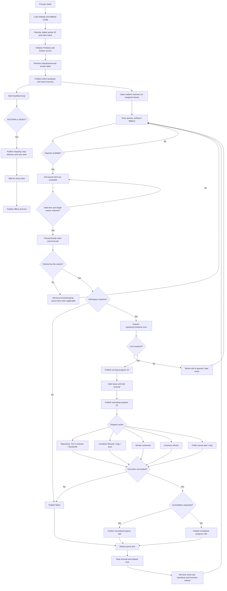
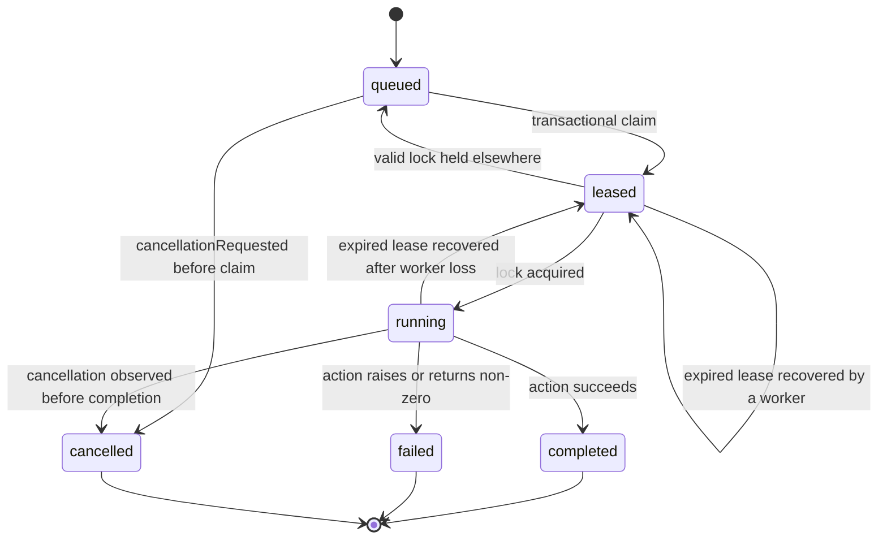

# Worker Design

Reference implementation: `services/worker/worker` (Python)  
Contract consumers: Python worker, Go worker, and future worker runtimes  
Last implementation audit: 2026-07-21

Runtime inventories: [`WORKER_DESIGN_PY.md`](WORKER_DESIGN_PY.md) ·
[`WORKER_DESIGN_GO.md`](WORKER_DESIGN_GO.md)

## Purpose

The worker is the execution agent for Docker Panel Lite. It runs on a Docker
host, connects to Firebase, reports its health and container inventory, leases
queued jobs, and executes deployment or container operations on behalf of the
web dashboard.

This document describes the worker requirements and expected behavior
independently of implementation language. Any runtime that follows this design
must speak the same Firebase protocol, preserve the same ownership model, and
produce compatible updates for the dashboard.

## Core Capability Inventory

The worker contract is divided into two inventories:

1. **Actions** are commands accepted through the job protocol. They are the
   externally observable functionality of the worker.
2. **Auxiliary capabilities** are internal responsibilities required to execute
   those actions safely and consistently.

A worker runtime reaches parity only when it implements both inventories. Having
an action handler without its required leasing, locking, security, publication,
and cleanup behavior does not count as complete implementation.

## Action Inventory

The canonical worker accepts exactly these 16 job actions.

### Repository actions

| Action | Core purpose |
| --- | --- |
| `discover_branches` | List remote Git branches and identify the default branch. |
| `sync` | Clone or update the configured repository and branch. |
| `read_compose` | Synchronize and return the validated Compose file content. |
| `deploy` | Synchronize and deploy a Compose or Dockerfile repository. |
| `build` | Build/deploy the repository using its configured execution mode. |
| `stop` | Stop the Compose project or remove the managed Dockerfile container. |
| `tunnel_start` | Start or reuse public tunnels for repository services. |
| `tunnel_stop` | Stop repository tunnels and clear public URL state. |

### Container actions

| Action | Core purpose |
| --- | --- |
| `inventory_refresh` | Reconcile Docker containers with workspace inventory records. |
| `container_start` | Start a selected container. |
| `container_stop` | Stop a selected non-worker container. |
| `container_restart` | Restart a selected container. |
| `container_delete` | Force-remove a selected non-worker container. |
| `container_logs` | Load and store the bounded log tail of a container. |
| `container_exec` | Execute a bounded, non-interactive command inside a non-worker container. |
| `container_tunnel_start` | Open a public URL for a running local container without requiring a repository registration. |

### Worker action

| Action | Core purpose |
| --- | --- |
| `worker_command` | Execute a bounded command in the worker clone root or a repository clone. |

The detailed inputs, outputs, side effects, and limits for these actions are in
[Complete Action Contract](#complete-action-contract).

## Auxiliary Capability Inventory

These capabilities are not independent job actions. They form the reusable core
that every action depends on.

| Auxiliary capability | Core responsibility |
| --- | --- |
| Configuration | Load runtime/fallback environment, validate limits, and resolve Firebase, Docker, paths, pool, shards, and tunnel settings. |
| Worker identity | Produce a stable worker ID from configuration, host fingerprint, persisted marker, or generated fallback. |
| Claim token | Generate/persist a secure token, publish only its SHA-256 hash, and expose the raw token only for claiming. |
| Firebase client | Authenticate, read/write/patch records, support listeners, and provide transactional or conditional updates. |
| Lifecycle | Start, publish `online`, handle signals, publish `stopping`, drain active work, publish `offline`, and close resources. |
| Heartbeat | Publish runtime/host/capacity/Docker metadata while preserving ownership and sharing state. |
| Queue discovery | Listen to assigned shards and poll as a recovery fallback; sort and filter candidate jobs. |
| Concurrency | Enforce maximum active jobs and prevent duplicate local execution. |
| Job leasing | Claim atomically, recover expired leases, increment attempts, assign worker, and renew leases. |
| Resource locking | Acquire, renew, and release repository/container locks to prevent conflicting actions. |
| Cancellation | Detect cancellation before/during/after execution and interrupt active process trees when possible. |
| Job publication | Mirror progress and terminal results to canonical jobs and workspace deployments. |
| Queue cleanup | Remove terminal/orphaned queue items and wake scanning after completion. |
| Docker summary | Report daemon availability, versions, platform, container counts, and image counts with bounded caching. |
| Container inventory | Normalize Docker records, mark ownership, reconcile stale records, and preserve bounded log tails. |
| Deployment port validation | In the backend, validate declared `host:container` mappings, reserve host ports per worker pool, and reject deploy/build jobs when an active container already publishes the requested TCP/UDP port on the selected worker. |
| Worker protection | Identify the worker container and reject stop, delete, and exec operations against it. |
| Repository paths | Derive safe clone/project paths and reject traversal outside configured roots. |
| Git credentials | Decrypt, inject only for Git operations, and redact raw/encoded tokens from errors. |
| Git synchronization | Discover branches, clone, fetch, switch/track, and fast-forward pull repositories. |
| Environment normalization | Parse object, JSON, dotenv, legacy, and list formats; merge precedence and validate keys. |
| Environment materialization | Write `.env` and generate Compose service overrides without leaking secrets. |
| Compose execution | Validate Compose path and run bounded deploy/stop commands with stable project naming. |
| Dockerfile execution | Validate Dockerfile, build/tag image, replace managed container, and apply environment/ports. |
| Command execution | Parse commands, disable interactive Compose behavior, enforce timeout/cancellation, and bound output. |
| Secret decryption | Implement the versioned AES-256-GCM contract used by the web application. |
| Tunnel target discovery | Resolve host-port or container-network targets and attach the worker to required Docker networks. |
| Tunnel lifecycle | Start/reuse/track/stop per-service tunnel processes and persist bounded state/log metadata. |
| Error handling | Compact/redact errors, publish failure safely, release resources, and keep the worker alive. |
| Observability | Emit useful lifecycle/action logs without exposing credentials or unbounded command output. |
| Application error registry | Publish sanitized failures to workspace `app_logs` with actor, attempted action, source, context, and timestamp. Worker failures identify the worker; UI/backend failures identify the authenticated user. |

## Auxiliary Core Responsibilities

This list is the minimum capability contract for every worker runtime. A new
implementation, including the Go worker, must account for every responsibility
even when a capability is initially marked as pending.

### Bootstrap, configuration, and identity

- Load runtime environment variables and an optional fallback environment file,
  with runtime values taking precedence.
- Resolve Firebase database URL/project, service-account credentials, workspace,
  pool, shards, concurrency, lease duration, polling interval, clone/data paths,
  encryption key, and tunnel configuration.
- Resolve a stable worker ID from explicit configuration, Docker/host fingerprint,
  persisted marker, or generated fallback, in that order.
- Resolve and persist a cryptographically secure worker claim token with mode
  `0600`; publish only its SHA-256 hash and print the raw token only for claiming.
- Select and preserve a human-readable worker label without colliding with labels
  already registered in the workspace.
- Initialize Firebase before accepting work and register signal/shutdown handling.

### Lifecycle and heartbeat

- Publish `online`, `stopping`, and `offline` agent states.
- Report worker identity, host/runtime metadata, paths, pool/shards, concurrency,
  active jobs, lease/poll settings, Docker summary, and tunnel availability.
- Preserve ownership and sharing metadata already stored on the agent record.
- Refresh heartbeats periodically and after every completed/failed job.
- Cache expensive Docker summary calls for a bounded period.
- Close realtime listeners, stop accepting new jobs, wait for active jobs, and
  publish `offline` during graceful shutdown.

### Queue, concurrency, leasing, and locking

- Listen to every assigned Firebase queue shard and retain polling as a recovery
  path if events are missed or listeners disconnect.
- Sort queue candidates by creation time, remove malformed/orphaned entries,
  respect `targetWorkerId`, and enforce maximum worker concurrency.
- Claim the canonical job transactionally/conditionally; accept only queued jobs
  or leased/running jobs whose lease expired.
- Detect cancellation before execution and before publishing final success.
- Increment attempts, set `startedAt`, assign `workerId`, and maintain
  `leaseExpiresAt`.
- Acquire a repository lock or container lock before execution; return the job to
  `queued` if another valid lock exists.
- Renew both job lease and lock lease while the action is active.
- Release locks, remove queue entries, remove the job from the active set, wake the
  scanner, and refresh heartbeat/inventory on every terminal path.

### Job protocol and result publication

- Mirror every job update to both `jobs/{jobId}` and
  `workspaces/{workspaceId}/deployments/{jobId}`.
- Publish progress (`10` claimed, `25` executing, `100` terminal), status,
  message, timestamps, lease state, command output, and exit code as applicable.
- Support `queued`, `leased`, `running`, `completed`, `failed`, and `cancelled`.
- Cap failure messages, command output, logs, and process errors before writing to
  Firebase.
- Keep the worker alive after individual action, Docker, Git, Firebase, or tunnel
  failures.

### Docker host and container management

- Connect to the local Docker daemon and report daemon version, API version, OS,
  architecture, container counts, running counts, and image counts.
- Publish complete running/stopped container inventory with image, state, ports,
  Compose project/service labels, worker ownership, and timestamps.
- Reconcile renamed/legacy IDs and delete stale container records owned by this
  worker without deleting records owned by another worker.
- Identify the worker container and protect it from stop, delete, and exec both in
  published metadata and during execution.
- Implement inventory refresh, logs, start, stop, restart, delete, and exec.
- Store the latest 100 log lines (maximum 100,000 characters) and truncate command
  output to the latest 120,000 characters.

### Repository, Git, and deployment management

- Resolve repository paths from safe names and prohibit escape from the clone
  directory.
- Decrypt configured Git credentials, inject them only into HTTPS Git operations,
  and redact raw and URL-encoded tokens from errors.
- Discover remote branches with the default branch first; clone, fetch, switch,
  track, and fast-forward pull the configured branch.
- Read Compose content only from a validated repository-relative path and reject
  files larger than 1 MB.
- Normalize and merge workspace, legacy repository, current repository, and
  Firebase-stored environment values with repository values taking precedence.
- Validate environment keys, normalize scalar/JSON/dotenv values, strip null
  bytes, write `.env`, and generate Compose environment overrides per service.
- Deploy/stop Compose projects with a stable project name and a 900-second bound.
- Build Dockerfiles, tag managed images, replace managed containers, and apply
  configured environment and port mappings.
- Before enqueueing a Dockerfile deploy/build, the backend must validate the
  declared mappings and compare their host-side TCP/UDP ports with the selected
  worker's current container inventory. The repository's own project is excluded
  so a normal replacement deploy can reuse its existing mapping. Repository
  save/import also reserves declared host ports within the same worker pool.
- Treat the backend check as an early conflict guard; the Docker daemon remains
  the final authority because inventory can change between validation and bind.
- Return backend preflight failures to the deployment control immediately so the
  UI identifies the occupied port and owning container instead of silently
  creating only a failed deployment record.
- Publish worker-side validation failures as the deployment job `message`; the
  repository UI exposes these job events from a dedicated diagnostics control,
  separate from container stdout/stderr logs.
- Each worker must repeat the validation against its local Docker daemon directly
  before deployment. Compose workers resolve the effective merged configuration
  and validate its published ports; Dockerfile workers validate the repository
  mappings. Running containers from the same project are excluded for replacement.

### Commands, secrets, and public tunnels

- Execute privileged worker commands in the clone root or selected repository,
  normalize Compose exec to non-interactive mode, enforce 5–1800 second bounds,
  preserve combined output, and publish exit code.
- Execute container commands through `/bin/sh -lc`, remove outer Compose exec
  syntax when supplied, disable TTY/stdin, and preserve output/exit code.
- Decrypt AES-256-GCM credentials and repository tunnel tokens using the same
  versioned payload contract as the web application.
- Resolve tunnel targets from host port mappings or container IP/internal port,
  connect the worker container to target networks when necessary, and support one
  tunnel per Compose service.
- Resolve Compose services using their Docker labels, report the running service
  inventory when a requested service is absent, and route host-network services
  through `host.docker.internal` with their configured internal port.
- Support repository/service domains, repository-specific encrypted ngrok tokens,
  persisted PID/state/log files, reuse of compatible tunnels, bounded startup,
  graceful/forced stop, and cleanup by repository prefix.
- Publish and clear the complete public URL/tunnel metadata contract.

The worker is not an authentication authority. User access decisions are made by
the web application before a job is queued. The worker still enforces local
safety checks such as worker-container protection, path validation, and command
timeouts.

## Worker Execution Flow

The following flow is derived from the Python reference worker in
`services/worker/worker/main.py`. Other runtimes must preserve the same observable
protocol even if their internal concurrency model differs.



### Job State Machine



## Runtime Configuration

The worker reads configuration from environment variables and may also read a
fallback config file packaged with the worker image.

Required configuration:

- Firebase Realtime Database URL or project identity.
- Firebase service account credentials.
- Credential encryption key.
- Workspace ID.

Common worker configuration:

- `WORKER_ID`: explicit stable worker ID. Usually omitted.
- `WORKER_TOKEN`: explicit claim token. Usually omitted.
- `WORKER_LABEL`: human-readable label displayed in the dashboard.
- `WORKER_LOCATION`: optional host/location description.
- `WORKER_POOL`: queue pool, default `default`.
- `WORKER_SHARDS` or `QUEUE_SHARDS`: queue shards the worker should scan.
- `WORKER_MAX_CONCURRENCY`: maximum simultaneous jobs.
- `WORKER_LEASE_SECONDS`: job and lock lease duration.
- `WORKER_POLL_SECONDS`: polling interval when realtime listeners are not used.
- `APP_CLONE_DIR`: repository clone directory.
- `APP_DATA_DIR`: persistent worker state directory.
- `NGROK_ENABLED`, `NGROK_AUTHTOKEN`, `NGROK_REGION`, `NGROK_BIN`: public tunnel configuration.

Runtime environment values should override baked/default values.

## Persistent Identity

Each worker has a stable ID used for routing jobs and owning container records.

Worker ID resolution order:

1. Use `WORKER_ID` when explicitly configured.
2. Derive a stable ID from a host or Docker fingerprint when available.
3. Read an existing persisted ID from the worker data directory.
4. Generate and persist a new ID if no stable source exists.

The worker ID is not secret. It is safe to store in Firebase and display in
logs or the dashboard.

## Claim Token

Each worker has a claim token that proves the operator has access to that worker
installation.

Expected behavior:

- Use `WORKER_TOKEN` when explicitly configured.
- Otherwise generate a secure token.
- Persist generated tokens under the worker data directory.
- Store only a SHA-256 hash of the token in Firebase.
- Print the raw token in local worker logs so an operator can claim the worker.

The raw claim token is sensitive. Anyone with access to it may claim an
unclaimed worker. After a worker is claimed, ownership and sharing rules control
visibility and usage.

## Firebase Data Model

The worker communicates through Firebase Realtime Database.

Main paths:

```text
workspaces/{workspaceId}/agents/{workerId}
jobs/{jobId}
workspaces/{workspaceId}/deployments/{jobId}
queues/{poolId}/{shardId}/{jobId}
locks/{workspaceId}/{lockKey}
workspaces/{workspaceId}/repositories/{repositoryId}
workspaces/{workspaceId}/containers/{containerId}
workspaces/{workspaceId}/environment
secrets/credentials/{workspaceId}/{credentialId}
secrets/ngrok/{workspaceId}/{repositoryId}
```

The worker must update both `jobs/{jobId}` and
`workspaces/{workspaceId}/deployments/{jobId}` when changing job status,
progress, messages, lease state, command output, or completion metadata.

## Heartbeat

The worker sends a heartbeat to:

```text
workspaces/{workspaceId}/agents/{workerId}
```

Heartbeat state includes:

- Worker ID, label, hostname, location, pool, shards, and runtime metadata.
- Status: `online`, `stopping`, or `offline`.
- Active job count and max concurrency.
- Lease and polling settings.
- Clone and data directory paths.
- Docker availability summary.
- Ngrok enabled/region status.
- Worker claim token hash.
- Last heartbeat timestamp.
- Startup timestamp.

The worker must preserve owner and sharing fields that already exist on the
agent record. Heartbeats must not erase:

- `claimedAt`
- `claimedBy`
- `ownerUid`
- `ownerEmail`
- `sharing`
- `shared`
- `public`
- `sharedEmails`

On graceful shutdown, the worker should send an `offline` heartbeat.

## Container Inventory

The worker periodically inspects Docker and publishes container records under:

```text
workspaces/{workspaceId}/containers/{containerRecordId}
```

Each container record should include:

- Stable dashboard record ID.
- Docker container ID.
- Name, image, status, ports, compose project, compose service.
- Worker ID, label, hostname, and pool.
- Last seen timestamp.
- Updated timestamp.
- Worker-container marker.
- Protected actions.

Worker containers must be protected from stop, delete, and exec actions through
both UI metadata and worker-side checks.

If a container previously owned by the worker disappears, the worker should
remove or mark the dashboard record as no longer present.

## Queue Flow

The dashboard creates a job and places a queue item under:

```text
jobs/{jobId}
queues/{poolId}/{shardId}/{jobId}
workspaces/{workspaceId}/deployments/{jobId}
```

Worker flow:

1. Scan or listen to configured queue shards.
2. Skip queue items targeted to another worker.
3. Respect max concurrency.
4. Read the canonical job from `jobs/{jobId}`.
5. Claim the job only if it is queued or safely recoverable from an expired lease.
6. Set status to `leased`, assign `workerId`, increment attempt, and set `leaseExpiresAt`.
7. Acquire a repository/container lock.
8. Publish status `running` and initial progress.
9. Renew lease and lock while the job runs.
10. Execute the requested action.
11. Publish success, failure, or cancellation.
12. Delete the queue item.
13. Release the lock.
14. Refresh heartbeat and inventory when appropriate.

Leasing must be conditional or transactional. Two workers must not be able to
claim and run the same job at the same time.

## Locks

The worker uses locks to avoid conflicting operations.

Lock path:

```text
locks/{workspaceId}/{lockKey}
```

Lock key rules:

- Repository jobs lock by `repositoryId`.
- Container jobs lock by `container-{containerId}`.

The lock contains:

- `jobId`
- `workerId`
- `expiresAt`

If a lock is held by another active job, the worker should requeue the job by
clearing the worker lease and setting a waiting message. Expired locks may be
recovered.

## Job States

Supported job states:

- `queued`
- `leased`
- `running`
- `completed`
- `failed`
- `cancelled`

Expected state transitions:

```text
queued -> leased -> running -> completed
queued -> leased -> running -> failed
queued -> leased -> running -> cancelled
queued -> cancelled
leased/running -> queued, when waiting for a lock
leased/running with expired lease -> leased by another worker
```

The worker should observe cancellation before execution and before final
completion. Active process interruption is an improvement target listed in final
notes.

## Repository Actions

Repository actions operate on records under:

```text
workspaces/{workspaceId}/repositories/{repositoryId}
```

Supported actions:

- `discover_branches`
- `sync`
- `read_compose`
- `deploy`
- `build`
- `stop`
- `tunnel_start`
- `tunnel_stop`

## Complete Action Contract

Every worker runtime must recognize the following actions. Unknown actions must
fail explicitly rather than being silently ignored.

| Action | Target | Required behavior | Primary side effects |
| --- | --- | --- | --- |
| `discover_branches` | Repository | Decrypt optional Git credential and list remote heads with default first. | `availableBranches`, `branchesUpdatedAt` |
| `sync` | Repository | Safely clone or fast-forward pull the configured branch. | Local clone; synchronized message |
| `read_compose` | Repository | Sync, validate relative Compose path, enforce 1 MB maximum, read UTF-8 with replacement. | `composeContent` |
| `deploy` | Repository | Sync and deploy Compose or Dockerfile mode; optionally open tunnels. | Containers/images and repository tunnel metadata |
| `build` | Repository | Same current execution path as deploy for the configured repository mode. | Containers/images and optional tunnel metadata |
| `stop` | Repository | Stop Compose stack or remove managed Dockerfile container; stop tunnels. | Cleared public URL/tunnel metadata |
| `tunnel_start` | Repository/service | Resolve running targets and start/reuse requested tunnel(s). | `publicUrl`, `publicUrls`, `publicTunnels`, status/worker/timestamp fields |
| `tunnel_stop` | Repository | Stop all tunnel processes by repository prefix. | Cleared public URL/tunnel metadata |
| `inventory_refresh` | Workspace | Read all Docker containers and reconcile this worker's records. | `workspaces/{workspaceId}/containers/*` |
| `container_start` | Container | Resolve and start the container. | Docker state; refreshed inventory |
| `container_stop` | Container | Reject worker container; stop with 20-second grace. | Docker state; refreshed inventory |
| `container_restart` | Container | Restart with 20-second grace. | Docker state; refreshed inventory |
| `container_delete` | Container | Reject worker container and force-remove target. | Docker state; refreshed inventory |
| `container_logs` | Container | Read latest 100 lines and cap stored tail at 100,000 characters. | Container `logTail` |
| `container_exec` | Container | Reject worker container; run non-interactive shell command with bounded timeout. | `commandOutput`, `commandExitCode` |
| `container_tunnel_start` | Local container | Resolve a published port or reachable container IP/internal port and start/reuse a worker-owned tunnel without repository metadata. | Container public URL/tunnel metadata |
| `worker_command` | Worker/repository | Run parsed command in clone root or repository with bounded timeout and merged environment. | `commandOutput`, `commandExitCode` |

All actions use the common lease, lock, progress, mirrored publication, failure,
queue cleanup, and post-job heartbeat flow. A runtime is not protocol-compatible
if it implements an action but omits those surrounding guarantees.

### Branch Discovery

The worker lists remote Git branches for the repository URL. If a credential is
configured, it decrypts and injects the token into the Git operation. Tokens
must not be logged.

Result updates:

- `availableBranches`
- `branchesUpdatedAt`

### Repository Sync

The worker clones or pulls the repository into its clone directory.

Requirements:

- Repository paths must be derived from a safe project name.
- The resolved path must stay inside the configured clone directory.
- Git credentials must be redacted from logs and errors.
- Branch selection should be honored when configured.

### Read Compose

For Compose repositories, the worker reads the configured Compose file and
stores its content on the repository record.

Requirements:

- Compose file path must be relative.
- Path traversal outside the repository must be blocked.
- File must exist.
- Content is limited to 1 MB.

Result update:

- `composeContent`

### Deploy and Build

Deployment behavior depends on repository mode.

Compose mode:

- Sync repository.
- Load workspace and repository environment values.
- Write a `.env` file.
- Generate an environment override file when needed.
- Run `docker compose -p {project} -f {composeFile} [-f {override}] up -d --build`.
- Optionally start public tunnels if public tunneling is enabled on the repository.

Dockerfile mode:

- Validate that configured host ports are not reserved in the repository pool
  and are not currently published by another active container on the target worker.
- Sync repository.
- Validate Dockerfile path.
- Load environment.
- Build an image tagged for the project.
- Replace the existing managed container.
- Run the container with configured ports and environment.
- Optionally start public tunnels if enabled.

### Stop

Compose mode stops the Compose stack. Dockerfile mode removes the managed
container. Both modes should clear public tunnel state.

### Public Tunnels

Public tunnels expose running repository services through ngrok or a compatible
tunnel provider.

Expected behavior:

- Resolve running target containers.
- Determine a target URL from host port mapping or container IP and internal port.
- Support one tunnel per Compose service.
- Support optional domain per repository or per service.
- Read repository-specific tunnel tokens from `secrets/ngrok`.
- Store `publicUrl`, `publicUrls`, `publicTunnels`, `publicTunnelStatus`,
  `publicTunnelTarget`, `publicTunnelWorkerId`, `publicTunnelWorkerLabel`, and
  `publicTunnelUpdatedAt`.
- Stop tunnels by repository prefix.
- Clear public URL state on stop.

## Container Actions

Supported container actions:

- `inventory_refresh`
- `container_start`
- `container_stop`
- `container_restart`
- `container_delete`
- `container_logs`
- `container_exec`

Behavior:

- Resolve containers by dashboard record ID, Docker ID, name, or container ref.
- Protect the worker container from stop, delete, and exec.
- Refresh container inventory after mutating actions.
- Store log tail for `container_logs`.
- Limit log output size.

`container_exec` runs a non-interactive shell command inside the target
container and publishes:

- `commandOutput`
- `commandExitCode`

Non-zero command exit codes should fail the job while preserving output.

## Worker Commands

`worker_command` runs a command on the worker host/container.

Behavior:

- If a repository is specified, use that repository clone as the working directory.
- If no repository is specified, use the worker clone root.
- Load workspace and repository environment when a repository is present.
- Normalize Compose exec commands to non-interactive mode.
- Enforce timeout limits.
- Publish `commandOutput` and `commandExitCode`.
- Fail the job when the exit code is non-zero.

Worker commands are powerful because the worker has Docker access. They should
be treated as privileged operations.

## Environment Loading

Environment values may come from:

- Workspace-level environment.
- Repository `environment`.
- Legacy repository `env` or `env_vars`.
- Imported JSON or text formats.

Expected behavior:

- Merge workspace values first.
- Merge repository values after workspace values.
- Repository values override workspace values.
- Accept object maps, JSON strings, dotenv-style text, and simple arrays where supported.
- Validate environment variable names.
- Strip null bytes.
- Preserve multiline values when possible.

Environment is used for Compose, Dockerfile containers, and repository-scoped
worker commands.

## Secret Handling

Secrets are stored outside normal workspace records under `secrets/...`.

Supported secret types:

- Git credentials under `secrets/credentials/{workspaceId}/{credentialId}`.
- Repository ngrok tokens under `secrets/ngrok/{workspaceId}/{repositoryId}`.

Requirements:

- Use AES-256-GCM compatible with the web application secret format.
- Never write decrypted secrets back to normal workspace records.
- Never log raw secrets.
- Prefer masked metadata in UI records.

## Error Handling

Worker errors should be compact and useful.

Expected behavior:

- Publish `failed` status with a message capped to a safe length.
- Preserve command output for command jobs.
- Delete failed queue items to avoid infinite immediate retries.
- Release locks after failure.
- Keep heartbeat alive after job failures.
- Redact credentials from Git and command output when possible.
- Write a sanitized `app_logs` entry for job and worker-infrastructure failures.
- Use the same action names as the job/UI action contract so failures can be
  grouped across runtimes (`deploy`, `build`, `sync`, tunnels, containers, and commands).
- Include worker identity for worker events and user identity for UI/backend
  events, plus repository/container/job identifiers when available.
- Store `runtime`, `functionName`, `action`, and `message` as separate fields:
  runtime identifies whether the failure occurred in Python worker, Go worker, or
  web; function identifies the failing code location; action preserves the user/job
  intent; message contains the sanitized failure detail.
- Error-reporting failures must never crash the worker or recursively report.
- Administrators may drain up to 1000 recent `app_logs` records through the web
  backend. A drain returns them as `app-logs.logs` and deletes only the returned
  IDs, leaving errors created concurrently for the next collection.

Docker and Compose errors should be compacted to the most useful lines instead
of storing extremely long output.

## Security Boundaries

The worker is a high-trust component.

Important security facts:

- The worker usually mounts the Docker socket.
- Docker socket access is effectively host-level control.
- Repository builds can execute untrusted Dockerfiles, Compose files, and build scripts.
- Worker commands can run processes with the worker container's permissions.
- Container exec can access runtime secrets inside containers.
- Public tunnels expose internal services externally.
- Baked worker images may contain Firebase credentials and encryption keys.

The worker should be deployed only on trusted hosts and should operate trusted
repositories unless additional sandboxing or approval workflows are added.

## Language-Independent Module Model

Any implementation should provide these modules or equivalent responsibilities.
The Python files listed here are the reference behavior to inspect when creating
or reviewing another runtime.

| Contract module | Python reference | Contains |
| --- | --- | --- |
| Main lifecycle, heartbeat, queue, lease, lock, inventory | `worker/main.py` | `Worker`, listeners, scanner, claim, process, renewal, publication, shutdown |
| Configuration and stable ID | `worker/config.py` | Environment/fallback loading, Firebase discovery, fingerprint/marker identity, limits |
| Action executor and environment | `worker/executor.py` | Repository/container/command dispatch, environment, path validation, Compose/Dockerfile, tunnels |
| Firebase runtime | `worker/firebase_runtime.py` | Admin initialization and database references |
| Secret contract | `worker/secrets.py` | AES-256-GCM version 1 decryption |
| Docker primitives | `worker/core/docker_ops.py` | Docker SDK connection and `.env` writer |
| Git primitives | `worker/core/git.py` | Branch listing, clone, fetch/switch/pull, credential redaction |
| Tunnel process manager | `worker/core/ngrok.py` | PID/state/log lifecycle and URL discovery |
| Shared utilities | `worker/core/utils.py` | Port parsing and safe relative path validation |

### Config Module

Loads environment, fallback config files, Firebase settings, worker paths,
pool/shard settings, Docker/ngrok settings, and runtime limits.

### Identity Module

Resolves stable worker ID, persists worker identity, generates claim tokens,
and computes claim token hashes.

### Firebase Client Module

Reads and writes Firebase records, supports conditional/transactional updates,
patches mirrored paths, and handles authentication using service-account
credentials.

### Heartbeat Module

Builds and publishes agent heartbeat records while preserving ownership and
sharing metadata.

### Queue Module

Scans/listens to queue shards, claims jobs, enforces concurrency, manages active
jobs, renews leases, publishes state, and deletes queue items.

### Lock Module

Acquires, renews, and releases repository/container locks.

### Docker Module

Collects Docker summary and inventory, performs container lifecycle actions,
reads logs, executes container commands, runs Dockerfile builds, and protects
worker containers.

### Git Module

Lists branches, clones repositories, pulls updates, checks out branches, and
redacts credentials.

### Executor Module

Maps job actions to repository/container/command/tunnel behavior and returns
dashboard-compatible messages and updates.

### Environment Module

Normalizes, validates, merges, and writes environment variables for deployment
and command execution.

### Secret Module

Decrypts credential and tunnel secrets using the shared encryption contract.

### Tunnel Module

Starts, tracks, stops, and reports public tunnels for repository services.

## Operational Limits

Current design limits:

- Compose file content returned to the dashboard is limited to 1 MB.
- Container logs and command output are truncated before storage.
- Commands must have bounded timeouts.
- Worker max concurrency limits simultaneous jobs per worker.
- Job leases and locks expire to allow recovery after worker crashes.
- Repository and file paths must remain inside configured worker directories.
- Worker containers cannot be stopped, deleted, or exec'd through the panel.

## Final Notes

Things still worth implementing or improving:

- Add active cancellation/interruption for running Docker, Compose, Git, ngrok,
  worker-command, and container-exec processes.
- Add a formal `docs/WORKER_RUNTIME_CONTRACT.md` with fixtures for every job
  action, success, failure, timeout, cancellation, and lease recovery case.
- Add automated parity tests that run the same Firebase job fixtures against
  every worker runtime.
- Add command allowlists or admin-managed command presets before treating
  arbitrary `worker_command` and `container_exec` as broadly safe.
- Add stronger audit logs for deploys, commands, sharing changes, worker claims,
  public tunnel opens, and credential usage.
- Add repository and worker allowlists so a worker owner can restrict what code
  may run on a host.
- Add Compose/Dockerfile policy scanning for privileged mode, host networking,
  host mounts, Docker socket mounts, and other high-risk settings.
- Add realtime queue listeners where unavailable, while keeping polling as a
  fallback.
- Add richer tunnel provider abstraction so ngrok is not the only public URL
  implementation.
- Add better stale tunnel reconciliation on worker restart.
- Add stronger secret-redaction for command output and deployment logs.
- Add production hardening for baked worker images, including safer defaults
  around `WORKER_BAKE_CONFIG`.
- Add runtime-specific publish commands for Python and Go worker images.
- Add live integration validation for deploy, tunnel, command, and inventory
  flows against a real workspace and Docker host.
